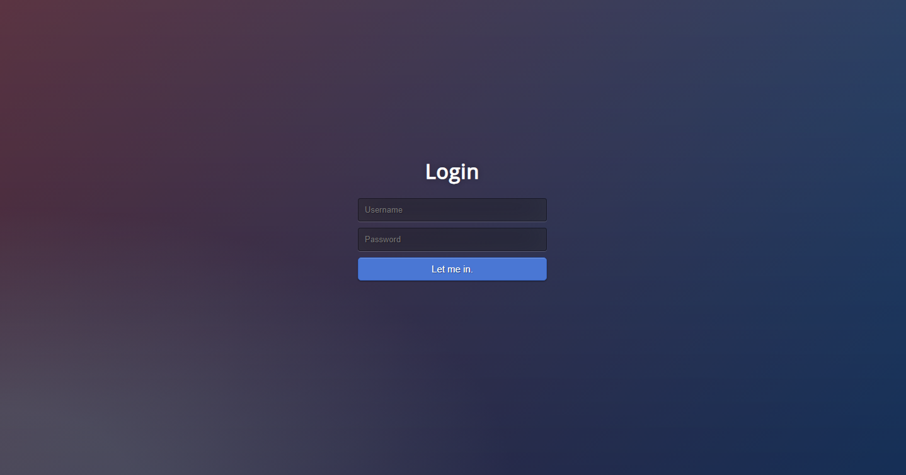
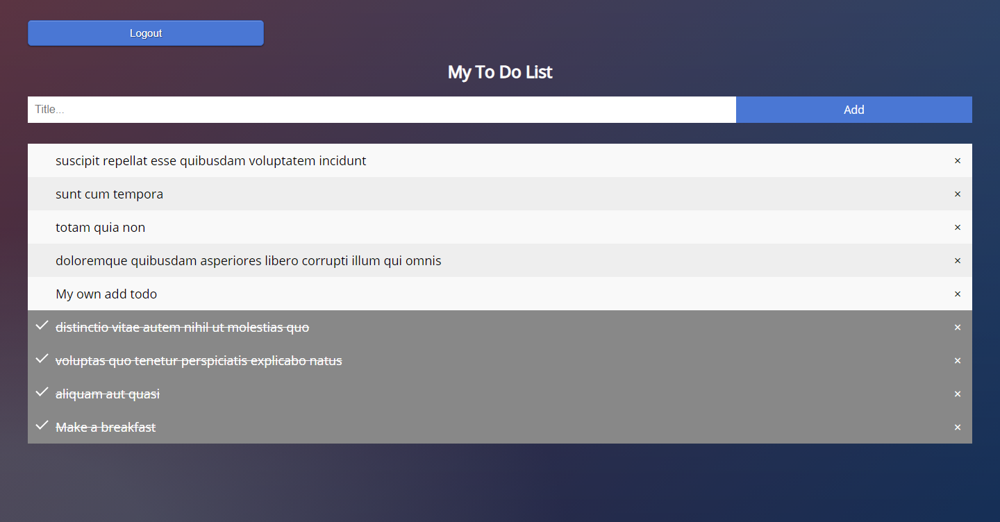

<h1>Simple React TODO App</h1>

Two main components:

– Login form 
– TODO list

The app uses two API sources:

For users: https://jsonplaceholder.typicode.com/users 
For todos: https://jsonplaceholder.typicode.com/todos

Login form CSS source (second - gradient form) 
https://speckyboy.com/login-pages-html5-css/
Todo list CSS source 
https://www.w3schools.com/howto/howto_js_todolist.asp

Showcase:

